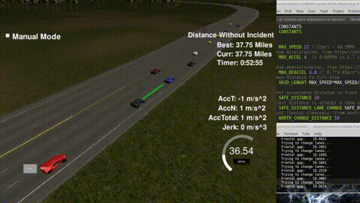
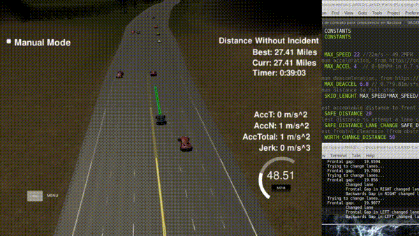

# Path Planning

## Model considerations

The making of the path planner took into account the following parameters:

* Maximum acceleration	[`MAX_ACCEL`]	(from Powertrain)
* Maximum deceleration [`MAX_DEACCEL`]	(from breaking distance)
* Skid Distance 	[`SKID_LENGHT`]	(minimum distance to a full stop)

These and other tunable parameters are found in `constants.h`.

For both acceleration and deceleration data from [Nissan's Sentra](https://en.wikipedia.org/wiki/Nissan_Sentra) was used.

Additionally, a friction coefficient of 0.7 was used when calculating [breaking distance.](https://en.wikipedia.org/wiki/Braking_distance)

As for the skid distance, maximum speed was considered and double the normal distance was used, as to account for the simulator delays and sudden braking of other vehicles.

Path planning is composed of 2 parts:

- Speed control 
- Lane changing

The path is calculated using the last 2 executed points (if exist), the speed set point and destination lane over the next second to generate the next 30 points, to ease calculations, reference frame is shifted and rotated to meet our vehicle as the origin.

## Speed control

Speed control is implemented as follows:

- If there is no obstacle, accelerate at 30% of `MAX_ACCEL`, as to take into account the car never goes at full acceleration.

- If a car is detected, and the distance to it is less than the `SKID_LENGHT`, break at 20%, this tries to mimic the front vehicle speed, while allowing a smooth approach to it.

- If distance to front vehicle is less than `SAFE_DISTANCE`, car brakes harder (60%), as to try to keep a safe distance.

- If distance to front vehicle is less than 15m, an additional 40% of `MAX_DEACCEL` is applied, as an emergency brake. This helps cover sudden stops of other vehicles.

## Lane changing

Lane changing is triggered when the distance to front vehicle is less than `SAFE_DISTANCE`

Lane changing is conditional on the following:

1. A big enough front gap in the neighbor lane [`SAFE_DISTANCE_LANE_CHANGE`]
2. A big enough backwards gap in the neighbor lane [`SAFE_BACK_DISTANCE`]
3. A big enough clearance [`WORTH_CHANGE_DISTANCE`]

### Examples of application are as follows:

There is no big enough frontal gap to make a lane change, see that if a lane change was attempted, the sudden break of the white car will make our car break also, putting us in a tight spot between 4 vehicles.

Similar to the previous example, as the blue car pulls away, the chance of its sudden change in speed affecting us diminishes, so we can safely change lanes and increase our speed to chase it

Analog to the problem of the white car, we wait for the red car behind to enlarge it's distance to us, so we can safely change lanes even if changes in speed occur.

Here we see a complex scenario, where passing the red car is delayed by the proximity of the blue car, the second blue car prevents us from entering the central lane after the first one.

Here we can see a full speed lane change

